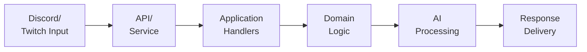
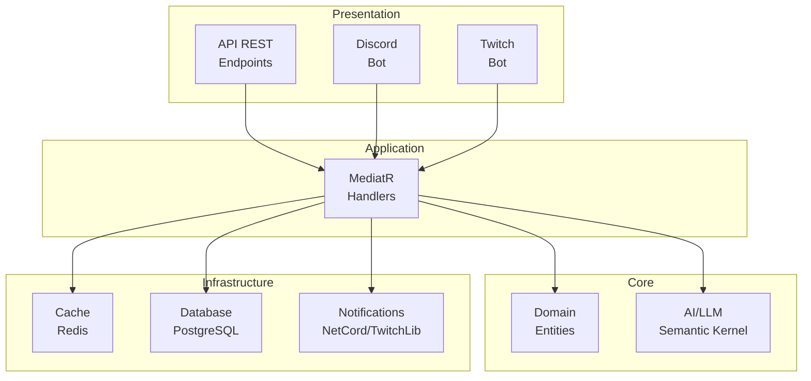

# Caramel's Architecture Overview

Caramel is a personal assistant platform connecting Discord and Twitch, processing user messages through AI-powered handlers and delivering intelligent responses.

## Message Flow

## System Architecture

## Core Modules

| Module | Purpose | Location |
|--------|---------|----------|
| **Domain** | Business entities, value objects, core rules | `src/Caramel.Domain` |
| **Application** | Use case handlers and CQRS operations | `src/Caramel.Application` |
| **API** | REST endpoints and OpenAPI documentation | `src/Caramel.API` |
| **AI** | LLM orchestration via Semantic Kernel | `src/Caramel.AI` |
| **Notifications** | Discord and Twitch message delivery | `src/Caramel.Notifications` |
| **Cache** | Distributed Redis caching layer | `src/Caramel.Cache` |
| **Database** | PostgreSQL persistence with EF Core/Marten | `src/Caramel.Database` |

## Finding Things

- **To add a command handler:** Create in `Application/Conversations/` following MediatR pattern
- **Error handling:** Use `Result<T>` from FluentResults; never throw from handlers
- **Add a new platform:** Create integration module in `src/` following Discord/Twitch pattern
- **Database queries:** Use repositories in `Database/` layer; access via DI
- **Logging:** Inject `ILogger<T>` and use for all operations
