# Caramel's Architecture Overview

Caramel is a personal assistant for neurodivergent users, built as a modular microservice with a focus on scalability and maintainability. The system leverages modern .NET patterns and practices:

- **gRPC**: Inter-service communication between API, Discord bot, and backend service
- **CQRS**: Command Query Responsibility Segregation using MediatR and FluentResults
- **Event Sourcing**: Marten with PostgreSQL as the source of truth
- **Semantic Kernel**: Microsoft's SDK for AI orchestration and LLM integration
- **Dependency Injection**: Modular, testable architecture throughout

---

## System Architecture

> **Twitch chat → UI flow (new):**
> Caramel.Twitch receives EventSub messages → publishes to Redis pub/sub `caramel:twitch:chat` → Caramel.API `TwitchChatRelayService` fans out over WebSocket `/ws/chat` → Vue `useTwitchChat` composable → `TwitchChat.vue` renders the feed.


Caramel uses a **hub-and-spoke architecture** where `Caramel.Service` acts as the central backend. Interface layers (`API`, `Discord`, `Twitch`) communicate with it via gRPC.


### Service Ports (Development)

| Service | Port | Protocol | Description |
|---------|------|----------|-------------|
| Caramel.Service | 5270 | gRPC | Central backend host |
| Caramel.API | 5144 | HTTP | REST gateway + Swagger UI |
| Caramel.Discord | 5145 | WebSocket | Discord bot (worker service, port exposed in Docker only) |
| Caramel.Twitch | 5146 | HTTP/WebSocket | Twitch bot with OAuth callback and EventSub |
| PostgreSQL | 5432 | TCP | Database |
| Redis | 6379 | TCP | Distributed cache |

---

## Project Structure

The solution follows Clean Architecture principles with pragmatic coupling where beneficial.


### Layer Organization

| Layer | Projects | Description |
|-------|----------|-------------|
| **Presentation** | `Caramel.Service`, `Caramel.API`, `Caramel.Discord`, `Caramel.Twitch` | Entry points and host applications |
| **Transport** | `Caramel.GRPC` | Shared gRPC contracts, clients, and interceptors |
| **Application** | `Caramel.Application` | Use cases, MediatR handlers, orchestration |
| **Infrastructure** | `Caramel.Database`, `Caramel.AI`, `Caramel.Cache`, `Caramel.Notifications` | External concerns: persistence, LLMs, caching, notifications |
| **Shared** | `Caramel.Core` | Common DTOs, logging utilities, extensions |
| **Domain** | `Caramel.Domain` | Pure business entities and value objects |

---

## Request Flow

This sequence shows how a Discord message flows through the system:


---

## Message Processing Workflow (Detailed)

This flowchart shows the complete ingress-to-egress flow for processing a user message:

```mermaid
flowchart TB
    subgraph Ingress ["🔽 Ingress Layer"]
        DM[Discord DM] --> IMH[IncomingMessageHandler]
        SC[Slash Command] --> SCM[SlashCommandModule]
        QC["Quick Command<br/>(todo/remind)"] --> QCP[QuickCommandParser]
    end

    subgraph Transport ["🔀 Transport Layer"]
        IMH --> |gRPC| GRPC[CaramelGrpcService]
        SCM --> |gRPC| GRPC
        QCP --> |gRPC| GRPC
    end

    subgraph Orchestration ["⚙️ Application Layer"]
        GRPC --> |MediatR| CMD[ProcessIncomingMessageCommand]
        CMD --> Handler[ProcessIncomingMessageCommandHandler]

        Handler --> VAL{Validate<br/>Request}
        VAL -->|Invalid| ERR1[Return Error]
        VAL -->|Valid| PERSON[PersonService.GetOrCreateAsync]

        PERSON --> ACCESS{Has<br/>Access?}
        ACCESS -->|No| ERR2[Return Access Denied]
        ACCESS -->|Yes| CHANNEL[Capture NotificationChannel]

        CHANNEL --> CONVO[Get/Create Conversation]
        CONVO --> SAVE_MSG[Save User Message]
    end

    subgraph AIProcessing ["🤖 AI Processing (3-Phase)"]
        SAVE_MSG --> CONTEXT[Build Context<br/>History + Active ToDos]

        subgraph Phase1 ["Phase 1: Tool Planning"]
            CONTEXT --> TP_REQ[CreateToolPlanningRequest]
            TP_REQ --> |Semantic Kernel| LLM1[LLM]
            LLM1 --> TP_JSON[Tool Plan JSON]
            TP_JSON --> PARSER[ToolPlanParser]
        end

        subgraph Phase2 ["Phase 2: Validation & Execution"]
            PARSER --> VALIDATOR[ToolPlanValidator]
            VALIDATOR --> APPROVED[Approved Calls]
            VALIDATOR --> BLOCKED[Blocked Calls]
            APPROVED --> RESOLVER[ToolCallResolver]
            RESOLVER --> EXECUTOR[ToolExecutionService]
            EXECUTOR --> |Reflection| PLUGINS[Plugins<br/>ToDo/Reminders/Person]
            PLUGINS --> RESULTS[ToolCallResults]
        end

        subgraph Phase3 ["Phase 3: Response Generation"]
            RESULTS --> SUMMARY[Actions Summary]
            BLOCKED --> SUMMARY
            SUMMARY --> RESP_REQ[CreateResponseRequest]
            RESP_REQ --> |Semantic Kernel| LLM2[LLM]
            LLM2 --> RESPONSE[Natural Language Response]
        end
    end

    subgraph Persistence ["💾 Persistence Layer"]
        PLUGINS --> |Events| MARTEN[(Marten<br/>Event Store)]
        MARTEN --> |Inline Projection| DOCS[(Document<br/>Read Models)]
        RESPONSE --> SAVE_REPLY[Save Reply to Conversation]
        SAVE_REPLY --> MARTEN
    end

    subgraph Egress ["🔼 Egress Layer"]
        RESPONSE --> GRPC_RESP[GrpcResult]
        GRPC_RESP --> DISCORD_SEND[Discord.SendAsync]
        DISCORD_SEND --> USER[User Receives Response]
    end

    subgraph Background ["⏰ Background Jobs"]
        PLUGINS --> |Schedule| QUARTZ[Quartz Scheduler]
        QUARTZ --> |Trigger| JOB[ToDoReminderJob]
        JOB --> NOTIFY[PersonNotificationClient]
        NOTIFY --> |Discord DM| USER
    end

    style Ingress fill:#e3f2fd
    style Transport fill:#f3e5f5
    style Orchestration fill:#fff9c4
    style AIProcessing fill:#e8f5e9
    style Persistence fill:#fce4ec
    style Egress fill:#e0f7fa
    style Background fill:#fff3e0
```



### Workflow Summary

| Phase | Component | Description |
|-------|-----------|-------------|
| **Ingress** | `IncomingMessageHandler`, `SlashCommandModule` | Receives Discord events, validates access via cache |
| **Transport** | `CaramelGrpcService` | Translates gRPC requests to MediatR commands |
| **Orchestration** | `ProcessIncomingMessageCommandHandler` | Validates, resolves person, manages conversation |
| **AI Phase 1** | `ToolPlanParser` | LLM generates JSON tool plan |
| **AI Phase 2** | `ToolPlanValidator` → `ToolExecutionService` | Validates and executes tool calls via reflection |
| **AI Phase 3** | Response generation | LLM creates natural language response |
| **Persistence** | Marten stores | Events appended, inline projections updated |
| **Egress** | gRPC response → Discord | Reply sent back to user |
| **Background** | Quartz → `ToDoReminderJob` | Scheduled reminders sent via notification channels |

---

## CQRS Pattern

Caramel uses MediatR for command/query separation with a unified Store pattern wrapping Marten.


### Command vs Query Flow

- **Commands** change state: `CreateToDoCommand` → Handler → Store → Event → Marten
- **Queries** read state: `GetToDoByIdQuery` → Handler → Store → Marten Document Query

---

## Event Sourcing

Caramel uses Marten as both event store and document database. Events are the source of truth, with inline projections for read models.


### Key Concepts

- **Events**: Immutable records in `Caramel.Database/*/Events/` (e.g., `ToDoCreatedEvent`, `ReminderCreatedEvent`)
- **Aggregates**: `Db*` classes with `Apply()` methods:
  - `DbPerson`, `DbNotificationChannel` - User management
  - `DbConversation`, `DbMessage` - Chat history
  - `DbToDo`, `DbReminder`, `DbToDoReminder` - Task and reminder management
- **Projections**: `SnapshotLifecycle.Inline` - read models update synchronously
- **Storage**: Events in `mt_events`, projections in `mt_doc_*` tables

---

## Projects

### Caramel.Domain

Core domain entities, value objects, and domain services. Pure business logic with no external dependencies.

**Aggregates:**
- `Conversations` - Chat history and messages
- `People` - User profiles and notification preferences
- `ToDos` - Tasks with priority, energy, and interest levels
- `Reminders` - Standalone reminders (in `ToDos/Models/Reminder.cs`)

**Common (Shared):**
- `Common/Enums/` - Shared enums like `Level` (Blue/Green/Yellow/Red), `Platform`
- `Common/ValueObjects/` - Shared value objects: `Content`, `CreatedOn`, `DisplayName`, `UpdatedOn`, `UtcDateTime`

---

### Caramel.Core

Shared utilities, abstractions, and contracts used across all projects.

**Subdirectories:**
- `Conversations/` - `IConversationStore` interface, DTOs
- `People/` - `IPersonStore` interface, `IPersonCache`, DTOs
- `ToDos/` - `IToDoStore`, `IReminderStore` interfaces, DTOs
- `Reminders/` - Reminder request DTOs
- `Notifications/` - `INotificationChannel`, `IPersonNotificationClient` interfaces
- `Logging/` - Source-generated logging with `[LoggerMessage]` attributes
- `API/` - API-specific DTOs

**Key Packages:** `FluentResults`

---

### Caramel.Application

Application layer with use-cases and business orchestration. Implements CQRS pattern using MediatR.

**Subdirectories:**
- `Conversations/` - Message processing orchestration
- `People/` - Person management, `PersonPlugin`
- `ToDos/` - Task management, `ToDoPlugin`
- `Reminders/` - Reminder management, `RemindersPlugin`

**Plugins:** Domain-specific AI plugins with `[KernelFunction]` decorated methods:
- `ToDoPlugin` - 13+ tool functions for task management
- `RemindersPlugin` - Reminder creation and management
- `PersonPlugin` - User preference management

**Key Packages:** `MediatR`

---

### Caramel.Database

Data persistence using Marten for event sourcing and Entity Framework Core for migrations. Contains stores, events, and aggregate projections.

**Database Aggregates (Db* classes):**
- `DbPerson` - Person aggregate with notification channels
- `DbNotificationChannel` - Notification channel settings
- `DbConversation` - Conversation aggregate
- `DbMessage` - Individual messages in conversations
- `DbToDo` - ToDo aggregate with inline projection
- `DbReminder` - Standalone reminder aggregate
- `DbToDoReminder` - Reminders linked to specific ToDos

**Stores:**
- `IPersonStore` / `PersonStore`
- `IConversationStore` / `ConversationStore`
- `IToDoStore` / `ToDoStore`
- `IReminderStore` / `ReminderStore`

**Key Packages:** `Marten`, `Microsoft.EntityFrameworkCore`, `Npgsql`

---

### Caramel.AI

AI agent implementations powered by Microsoft Semantic Kernel. Provides `ICaramelAIAgent` interface for chat completions, tool planning, and LLM interactions.

**Subdirectories:**
- `Plugins/` - Infrastructure plugins (e.g., `TimePlugin`)
- `Prompts/` - YAML prompt definitions:
  - `CaramelToolPlanning.yml` - Tool planning phase prompts
  - `CaramelToolCalling.yml` - Tool calling configuration
  - `CaramelResponse.yml` - Response generation prompts
  - `CaramelReminder.yml` - Reminder-specific prompts
  - `CaramelDailyPlanning.yml` - Daily task selection prompts
- `Tooling/` - Tool execution pipeline:
  - `ToolPlanValidator` - Validates tool calls against available plugins
  - `ToolCallResolver` - Resolves `[KernelFunction]` methods via reflection
  - `ToolExecutionService` - Executes validated tool calls
- `Planning/` - `ToolPlanParser` for JSON tool plan parsing
- `Requests/` - `AIRequestBuilder` fluent builder for AI requests

**Key Packages:** `Microsoft.SemanticKernel`

---

### Caramel.Cache

Redis-based distributed caching infrastructure.

**Key Packages:** `StackExchange.Redis`

---

### Caramel.GRPC

Shared gRPC communication infrastructure. Contains code-first contracts, client stubs, server services, and interceptors.

**Key Packages:** `protobuf-net.Grpc`, `Grpc.Net.Client`

---

### Caramel.Notifications

Outbound notification system with channel abstractions. Includes `DiscordNotificationChannel` for Discord DMs.

**Key Packages:** `NetCord`

---

### Caramel.Service

Main backend host application. Runs the gRPC server, Quartz scheduler (e.g., `ToDoReminderJob`), and orchestrates all backend components.

**Key Packages:** `Quartz`, `Grpc.AspNetCore`, `NetCord`

---

### Caramel.API

HTTP/REST gateway with OpenAPI documentation. Serves the Vue SPA and forwards requests to Caramel.Service via gRPC.
Also hosts the WebSocket endpoint for real-time Twitch chat broadcast to the UI.

**Endpoints:**
- `GET /ws/chat` - WebSocket endpoint; upgrade here to receive a live stream of `TwitchChatMessage` JSON frames
- `GET /openapi` - OpenAPI spec (development only)

**Real-time chat broadcast:**
1. `TwitchChatRelayService` (hosted service) subscribes to the Redis pub/sub channel `caramel:twitch:chat` on startup
2. When a frame arrives it fans out to every open WebSocket client registered in the shared `ConcurrentDictionary<string, WebSocket>`
3. The `/ws/chat` endpoint accepts upgrades, registers the socket, drains incoming frames (keep-alive), and de-registers on close

**Key Packages:** `Microsoft.AspNetCore.OpenApi`, `StackExchange.Redis`

---

### Caramel.Discord

Discord bot host using NetCord. Handles slash commands, interactions, and bot functionality.

**Key Packages:** `NetCord.Hosting`

---

### Caramel.Twitch

Twitch bot host with EventSub integration and OAuth authentication. Handles chat messages, whispers, and channel interactions via Twitch API.

**Features:**
- OAuth 2.0 authorization code flow for secure bot/broadcaster token management
- EventSub WebSocket subscriptions for real-time events (`channel.chat.message`)
- Publishes every incoming chat message to Redis pub/sub (`caramel:twitch:chat`) so `Caramel.API` can broadcast it to the UI via WebSocket
- Bot-directed message processing (commands, AI routing) via `ChatMessageEventHandler`
- gRPC client for communication with Caramel.Service

**HTTP Endpoints (port 5146):**
- `GET /auth/login` - Begins Twitch OAuth authorization code flow (redirects to Twitch)
- `GET /auth/callback` - Receives the authorization code, exchanges it for tokens, stores them
- `GET /auth/status` - Returns `{ "authorized": true/false }` indicating whether valid tokens are held
- `GET /health` - Liveness probe

**OAuth Scopes requested:**
`chat:read chat:edit whispers:read whispers:edit moderator:manage:banned_users moderator:manage:chat_messages channel:moderate user:bot user:read:chat user:write:chat`

**Core Components:**
- `Program.cs` - Startup, DI, OAuth endpoints, `EventSubLifecycleService`
- `Services/TwitchChatBroadcaster` (`ITwitchChatBroadcaster`) - Publishes all chat messages to Redis pub/sub
- `Handlers/ChatMessageEventHandler` - Broadcasts to Redis then routes bot-directed messages to AI/commands
- `Handlers/WhisperEventHandler` - Routes whispers to the AI
- `Extensions/TwitchPlatformExtension` - Maps Twitch user IDs to `PlatformId`
- `Auth/OAuthStateManager` - CSRF-safe state parameter generation and validation
- `Auth/TwitchTokenManager` - Access/refresh token lifecycle with automatic renewal

**Message broadcast flow:**
```
Twitch EventSub WS → ChannelChatMessage event
  → ChatMessageEventHandler.HandleAsync
      → ITwitchChatBroadcaster.PublishAsync → Redis pub/sub "caramel:twitch:chat"
      → (if bot-directed) command dispatch or AI routing via gRPC
```

**Configuration (see `.env.example`):**
```
Twitch__ClientId=your_twitch_client_id_here
Twitch__ClientSecret=your_twitch_client_secret_here
Twitch__OAuthCallbackUrl=http://localhost:5146/auth/callback
Twitch__EncryptionKey=your_secure_32_byte_base64_key_here
Twitch__BotUserId=your_bot_user_id_here
Twitch__ChannelIds=channel_id_1,channel_id_2
```

**Key Packages:** `TwitchLib.Api`, `TwitchLib.EventSub.Websockets`, `TwitchLib.EventSub.Core`, `StackExchange.Redis`, `Grpc.Net.Client`

**Development Port:** 5146 (exposed in Docker)

---

### Client

Vue 3 single-page application built with Vite and TypeScript.
Displays a live Twitch chat feed via WebSocket and provides a Twitch OAuth authorization button.

**Key UI features:**
- `TwitchChat.vue` - Full-screen chat panel: live message feed, connection status badge, "Authorize Twitch" button, clear and scroll-to-bottom controls
- `composables/useTwitchChat.ts` - Manages the WebSocket connection to `/ws/chat` with automatic reconnection, message capping at 200 entries, and reactive `ConnectionStatus`

**Vite dev proxy routing:**
| Path | Target | Notes |
|------|--------|-------|
| `/api` | `http://localhost:5144` | Caramel.API REST |
| `/ws` | `http://localhost:5144` (ws) | WebSocket upgrade |
| `/auth` | `http://localhost:5146` | Twitch OAuth (Caramel.Twitch) |

**Key Packages:** `vue`, `vite`, `typescript`

---

## Coding Practices

### General

- Use DTOs for inter-service communication
- Follow `.editorconfig`: 2-space indentation, UTF-8, max 120 character lines
- Prefer file-scoped namespaces (`namespace X;`)
- Sort `using` directives with `System` first

### Naming Conventions

| Type | Convention | Example |
|------|------------|---------|
| Classes/Records | PascalCase | `ToDoStore`, `PersonNotificationClient` |
| Interfaces | `I` prefix | `IToDoStore`, `ICaramelAIAgent` |
| Value Objects | Concept name | `ToDoId`, `Description`, `Priority` |
| DTOs | `DTO` suffix | `ToDoDTO`, `ChatCompletionRequestDTO` |
| Commands | `Command` suffix | `CreateToDoCommand` |
| Queries | `Query` suffix | `GetToDoByIdQuery` |
| Handlers | `Handler` suffix | `CreateToDoCommandHandler` |
| Events | `Event` suffix | `ToDoCreatedEvent` |

### Type Design

- Use `sealed` on classes/records not intended for inheritance
- Use `readonly record struct` for single-value wrappers (e.g., `ToDoId`)
- Use `record` for domain models with multiple properties
- Use primary constructors for dependency injection
- Mark nullable types explicitly with `?`

### Error Handling

- Use FluentResults `Result<T>` instead of exceptions for expected failures
- Return `Result.Ok(value)` for success, `Result.Fail(message)` for failures
- Use `result.IsFailed` and `result.IsSuccess` for control flow
- Always check `.IsFailed` before accessing `.Value`

### Async Patterns

- Accept optional `CancellationToken` with default value
- Suffix async methods with `Async`
- Return `Task<Result<T>>` for operations that can fail

### Logging

- Use source-generated logging with `[LoggerMessage]` attribute
- Group related logs in static partial classes (e.g., `ToDoLogs`)
- Include Event IDs for filtering

### Dependency Injection

- Register services in `ServiceCollectionExtension` classes
- Use `TryAdd*` for overridable defaults
- Prefer `AddScoped` for request-scoped, `AddSingleton` for config

### Testing

- Framework: xUnit with Moq
- Name pattern: `MethodName` + `Scenario` + `ExpectedResult`
- Use `MockSequence` for ordered verifications
- Organize with Arrange/Act/Assert

### gRPC Contracts

- Use `[DataContract]` and `[DataMember]` with explicit `Order`
- Use `required` properties with `init` setters

### Event Sourcing

- Events are immutable records
- Streams keyed by aggregate ID
- Use `StartStream` for new, `Append` for existing
- Configure inline snapshot projections

---

## Local Development

### Prerequisites

- [.NET 10 SDK](https://dotnet.microsoft.com/download)
- [Docker Desktop](https://www.docker.com/products/docker-desktop)

### Start Backing Services

```bash
docker-compose up -d pgsql redis
```

Verify: PostgreSQL on `localhost:5432`, Redis on `localhost:6379`

### Configuration

Copy `.env.example` to `.env` for Docker, or use User Secrets for local development:

```bash
# Caramel.Service
cd src/Caramel.Service
dotnet user-secrets set "CaramelAIConfig:ApiKey" "YOUR_API_KEY"

# Caramel.Discord
cd src/Caramel.Discord
dotnet user-secrets set "Discord:Token" "YOUR_DISCORD_BOT_TOKEN"
dotnet user-secrets set "Discord:PublicKey" "YOUR_DISCORD_PUBLIC_KEY"
```

### Running Services

Run each in a separate terminal:

```bash
# Terminal 1: Backend Service (gRPC + Scheduler)
dotnet watch --project src/Caramel.Service/Caramel.Service.csproj

# Terminal 2: HTTP API Gateway
dotnet watch --project src/Caramel.API/Caramel.API.csproj

# Terminal 3: Discord Bot
dotnet watch --project src/Caramel.Discord/Caramel.Discord.csproj
```

- **Swagger UI:** http://localhost:5144/swagger
- **gRPC:** localhost:5270

### Troubleshooting

- **Database errors:** Ensure Docker containers are running (`docker ps`)
- **gRPC errors:** Verify Caramel.Service is running on port 5270
- **Redis errors:** Check Redis connection string in appsettings

---

## AI-Assisted Development Container

Caramel includes an isolated, containerized development environment designed for AI-assisted coding. The `start-dev.sh` script launches an [OpenCode](https://opencode.ai) session inside a Docker/Podman container with all dependencies pre-installed, so you can let AI agents build, test, and modify code freely without affecting your host machine.

### How It Works

Project files are **copied into the container** at build time. The container owns all files, so AI agents can read, write, build, and test without permission issues or risk to your local environment. Changes flow back to the host exclusively via `git push` from inside the container.

```
Host Machine                          Container (caramel-dev)
┌─────────────────┐                  ┌──────────────────────────┐
│ ~/Projects/caramel│── COPY ──────>  │ /workspace               │
│ (your files)    │                  │   .NET 10 SDK            │
│                 │                  │   Node.js 22             │
│                 │<── git push ──  │   OpenCode + MCP servers  │
│                 │                  │   GitHub CLI              │
└─────────────────┘                  └──────┬───────────────────┘
                                            │ network
                                   ┌────────┴────────┐
                                   │  Postgres + Redis │
                                   │  (separate containers)│
                                   └─────────────────────┘
```

### Prerequisites

- Linux or WSL2
- Docker or Podman installed
- `~/.gitconfig` configured with your name and email
- `~/.ssh/` with SSH keys for git operations

### Quick Start

```bash
# Start on current branch
./start-dev.sh

# Start on a specific branch
./start-dev.sh feature/my-branch
```

The script will:
1. Auto-detect Docker or Podman
2. Build the dev container image (tooling layers are cached; only the file copy layer rebuilds)
3. Start Postgres and Redis via `compose.dev.yaml`
4. Wait for Postgres to be healthy
5. Launch OpenCode in an interactive container session

### What's Inside the Container

| Tool | Version | Purpose |
|------|---------|---------|
| .NET SDK | 10.0 | Build and test the solution |
| Node.js | 22 LTS | Frontend build and tooling |
| OpenCode | latest | AI coding assistant |
| GitHub CLI | latest | PR creation and repo operations |
| csharp-ls | latest | C# language server for LSP |

**MCP Servers** (available to AI agents):
- `memory` - Knowledge graph persistence across sessions
- `sequential-thinking` - Step-by-step reasoning for complex tasks

### File Layout

| Path | Purpose |
|------|---------|
| `start-dev.sh` | Launcher script (run from repo root) |
| `compose.dev.yaml` | Dev compose file (dev container + Postgres 16 + Redis 7) |
| `docker/Dockerfile.dev` | Dev container image definition |
| `docker/entrypoint.sh` | Container startup (branch checkout, dependency restore, OpenCode launch) |
| `docker/opencode.json` | OpenCode MCP server configuration |

### Stopping the Environment

When you exit OpenCode, the container is removed but **Postgres and Redis keep running** so you can restart quickly. To stop everything:

```bash
docker compose -f compose.dev.yaml down    # or: podman compose -f compose.dev.yaml down
```

---

## CI/CD

Pull requests to `main` trigger the **Build and Test** GitHub Actions workflow (`.github/workflows/pr-build-test.yml`):

| Step | Command |
|------|---------|
| .NET restore | `dotnet restore` |
| .NET build | `dotnet build --no-restore` |
| .NET tests | `dotnet test --no-build --no-restore` |
| Frontend install | `npm ci` (in `src/Client`) |
| Frontend build | `npm run build` (in `src/Client`) |

**Runtime versions:** .NET 10.x, Node.js 20.x

All checks must pass before a PR can be merged.
