# 🎲 Twitch Choose-Your-Own-Adventure (CYOA) System

## Overview

A Twitch-integrated, AI-powered Choose-Your-Own-Adventure game built into Caramel. Viewers collectively guide a branching narrative in real-time through voting, with an orb deck-builder mechanic that lets individual players influence story outcomes. AI generates the story through a multi-pass pipeline, weaving in community lore—recurring characters, themes, and storylines that viewers can redeem.

Every adventure becomes part of the channel's shared history, with past adventures influencing future ones through summaries and callbacks.

---

## Table of Contents

- [Core Concepts](#core-concepts)
- [System Architecture](#system-architecture)
- [AI Multi-Pass Pipeline](#ai-multi-pass-pipeline)
- [Domain Model](#domain-model)
- [Event Sourcing Design](#event-sourcing-design)
- [Orb Deck-Builder Mechanic](#orb-deck-builder-mechanic)
- [Twitch Integration](#twitch-integration)
- [Project Structure](#project-structure)
- [Data Flow Diagrams](#data-flow-diagrams)
- [API & Command Reference](#api--command-reference)
- [Configuration](#configuration)
- [Future Considerations](#future-considerations)

---

## Core Concepts

| Concept | Description |
|---------|-------------|
| **Adventure** | A single story session from start to conclusion. Composed of sequential chapters. |
| **Chapter** | One narrative beat: a few paragraphs of story text followed by branching options for chat to vote on. |
| **Seed** | The initial parameters that shape an adventure: redeemed characters, themes, storylines, and any orb effects applied at the start. |
| **Recurring Element** | A character, theme, or storyline that persists across adventures. Viewers redeem these to inject them into the current adventure. |
| **Orb** | A collectible item viewers earn through participation. Orbs can be "pondered" during story events to influence the narrative. |
| **Ponder** | The act of using an orb. Random pondering lets the AI choose the effect (which could be lucky or unlucky). Specific pondering guarantees the orb's intended effect. |
| **Vote Round** | A timed window where chat collectively picks the next story direction from AI-generated options. |
| **Adventure Summary** | An AI-generated summary created when an adventure concludes, stored for future history selection. |

---

## System Architecture


---

## AI Multi-Pass Pipeline

The AI pipeline uses multiple focused passes rather than a single monolithic prompt. Each pass has a specific job, uses an appropriate model tier, and produces a well-defined output.

### Pass 1: Guard Pass

**Purpose:** Content filtering, input validation, prompt injection detection.

| Aspect | Detail |
|--------|--------|
| **Model** | Fast/cheap model or rule-based engine |
| **Input** | Raw user input (redeemed elements, custom text) |
| **Output** | `Result<ValidatedInput>` — sanitized input or rejection reason |
| **Temperature** | 0.0 (deterministic) |

**Checks performed:**
- Blocked word/phrase filtering (configurable list)
- Prompt injection detection (e.g., "ignore previous instructions")
- Input length validation
- Character/theme/storyline existence verification against database
- Rate limiting (prevent spam redemptions)

```csharp
// Guard pass request builder pattern
agent.CreateRequest()
    .WithSystemPrompt(AdventurePrompts.GuardSystem)
    .WithMessage(new ChatMessageDTO("user", rawInput))
    .WithTemperature(0.0)
    .WithJsonMode(true)
    .ExecuteAsync(cancellationToken);
```

### Pass 2: Seed Generation Pass

**Purpose:** Build the narrative seed from redeemed elements and database state.

| Aspect | Detail |
|--------|--------|
| **Model** | Standard model |
| **Input** | Validated redemptions, active recurring elements from DB |
| **Output** | `AdventureSeed` — structured narrative setup |
| **Temperature** | 0.7 (creative but grounded) |

**The seed includes:**
- Redeemed characters with their established traits/history
- Redeemed themes with narrative implications
- Redeemed storylines with continuity notes
- Suggested genre/tone based on the combination
- Initial setting and conflict hook

### Pass 3: History Selection Pass

**Purpose:** Choose which past adventure summaries are relevant to this seed.

| Aspect | Detail |
|--------|--------|
| **Model** | Standard model (or RAG vector search) |
| **Input** | Adventure seed + list of past adventure summaries |
| **Output** | Selected summaries with relevance reasoning |
| **Temperature** | 0.3 (focused selection) |

**Two implementation paths:**

1. **RAG Path (preferred at scale):** Embed adventure summaries in a vector store. Query with the seed prompt to get semantically relevant summaries. PostgreSQL `pgvector` extension keeps everything in the same database.

2. **LLM Selection Path (simpler, works at low volume):** Pass all summaries (or recent N) to the LLM with the seed and ask it to pick the most relevant ones with justification.

### Pass 4: Story Generation Pass

**Purpose:** Generate the next chapter of narrative text plus branching options.

| Aspect | Detail |
|--------|--------|
| **Model** | Extended thinking / high-capability model |
| **Input** | Seed + selected history + current adventure state + any active orb effects |
| **Output** | `ChapterContent` — narrative paragraphs + voting options |
| **Temperature** | 0.9 (maximum creativity) |

**Output structure:**
```json
{
  "narrative": "Two paragraphs of vivid story text...",
  "options": [
    { "key": "A", "label": "Charge into the cave", "tone": "brave" },
    { "key": "B", "label": "Set a trap at the entrance", "tone": "cunning" },
    { "key": "C", "label": "Call for reinforcements", "tone": "cautious" }
  ],
  "activeOrbEffects": ["The Fire Orb's heat shimmers in the air..."],
  "narratorNotes": "Internal: tension is building, next chapter should escalate"
}
```

**This pass also receives:**
- Any orb effects that were pondered during the voting phase
- The winning vote from the previous round
- Running narrative context (previous chapter summaries, not full text)

### Pass 5: Summary Pass

**Purpose:** Generate a concise adventure summary when the adventure concludes.

| Aspect | Detail |
|--------|--------|
| **Model** | Standard model |
| **Input** | Full adventure event stream (all chapters, votes, orb plays) |
| **Output** | `AdventureSummary` — title, synopsis, key moments, character appearances |
| **Temperature** | 0.5 (accurate but readable) |

**Summary includes:**
- Auto-generated adventure title
- 2-3 paragraph synopsis
- List of characters who appeared and what happened to them
- Themes that were explored
- Notable orb moments
- Outcome/ending classification (triumphant, tragic, comedic, cliffhanger, etc.)

---

## Domain Model

### Aggregates & Entities

All domain types live in `Caramel.Domain/Adventures/`.

#### Adventure (Aggregate Root)

```csharp
// Caramel.Domain/Adventures/Models/Adventure.cs
public record Adventure
{
    public required AdventureId Id { get; init; }
    public required AdventureStatus Status { get; init; }
    public required AdventureSeed Seed { get; init; }
    public required IReadOnlyList<Chapter> Chapters { get; init; }
    public required IReadOnlyList<OrbPlay> OrbPlays { get; init; }
    public AdventureSummary? Summary { get; init; }
    public CreatedOn CreatedOn { get; init; }
    public UpdatedOn UpdatedOn { get; init; }
}
```

#### Chapter

```csharp
// Caramel.Domain/Adventures/Models/Chapter.cs
public record Chapter
{
    public required ChapterId Id { get; init; }
    public required int SequenceNumber { get; init; }
    public required NarrativeText Narrative { get; init; }
    public required IReadOnlyList<StoryOption> Options { get; init; }
    public StoryOptionKey? WinningOption { get; init; }
    public required IReadOnlyList<OrbEffect> ActiveOrbEffects { get; init; }
    public VoteRound? VoteRound { get; init; }
    public CreatedOn CreatedOn { get; init; }
}
```

#### Recurring Elements

```csharp
// Caramel.Domain/Adventures/Models/RecurringCharacter.cs
public record RecurringCharacter
{
    public required RecurringCharacterId Id { get; init; }
    public required CharacterName Name { get; init; }
    public required CharacterDescription Description { get; init; }
    public required IReadOnlyList<CharacterTrait> Traits { get; init; }
    public required int AppearanceCount { get; init; }
    public CreatedOn CreatedOn { get; init; }
    public UpdatedOn UpdatedOn { get; init; }
}

// Caramel.Domain/Adventures/Models/RecurringTheme.cs
public record RecurringTheme
{
    public required RecurringThemeId Id { get; init; }
    public required ThemeName Name { get; init; }
    public required ThemeDescription Description { get; init; }
    public required int UsageCount { get; init; }
    public CreatedOn CreatedOn { get; init; }
}

// Caramel.Domain/Adventures/Models/Storyline.cs
public record Storyline
{
    public required StorylineId Id { get; init; }
    public required StorylineName Name { get; init; }
    public required StorylineDescription Description { get; init; }
    public required StorylineStatus Status { get; init; }
    public required IReadOnlyList<AdventureId> AppearanceIds { get; init; }
    public CreatedOn CreatedOn { get; init; }
    public UpdatedOn UpdatedOn { get; init; }
}
```

#### Orb System

```csharp
// Caramel.Domain/Adventures/Models/Orb.cs
public record Orb
{
    public required OrbId Id { get; init; }
    public required PersonId OwnerId { get; init; }
    public required OrbType Type { get; init; }
    public required OrbRarity Rarity { get; init; }
    public bool IsUsed { get; init; }
    public CreatedOn AcquiredOn { get; init; }
}

// Caramel.Domain/Adventures/Models/OrbPlay.cs
public record OrbPlay
{
    public required OrbPlayId Id { get; init; }
    public required AdventureId AdventureId { get; init; }
    public required ChapterId ChapterId { get; init; }
    public required PersonId PlayerId { get; init; }
    public required OrbType OrbType { get; init; }
    public required bool WasRandom { get; init; }
    public required OrbEffect Effect { get; init; }
    public CreatedOn PlayedOn { get; init; }
}

// Caramel.Domain/Adventures/Models/OrbInventory.cs
public record OrbInventory
{
    public required PersonId OwnerId { get; init; }
    public required IReadOnlyList<Orb> Orbs { get; init; }
}
```

#### Vote Round

```csharp
// Caramel.Domain/Adventures/Models/VoteRound.cs
public record VoteRound
{
    public required VoteRoundId Id { get; init; }
    public required IReadOnlyList<StoryOption> Options { get; init; }
    public required IReadOnlyDictionary<StoryOptionKey, int> Tally { get; init; }
    public required VoteRoundStatus Status { get; init; }
    public required DateTime OpensAt { get; init; }
    public required DateTime ClosesAt { get; init; }
    public StoryOptionKey? WinningOption { get; init; }
}
```

### Value Objects

All in `Caramel.Domain/Adventures/ValueObjects/`:

```csharp
public readonly record struct AdventureId(Guid Value);
public readonly record struct ChapterId(Guid Value);
public readonly record struct OrbId(Guid Value);
public readonly record struct OrbPlayId(Guid Value);
public readonly record struct RecurringCharacterId(Guid Value);
public readonly record struct RecurringThemeId(Guid Value);
public readonly record struct StorylineId(Guid Value);
public readonly record struct VoteRoundId(Guid Value);
public readonly record struct StoryOptionKey(string Value);    // "A", "B", "C", etc.

public readonly record struct NarrativeText(string Value);
public readonly record struct CharacterName(string Value);
public readonly record struct CharacterDescription(string Value);
public readonly record struct CharacterTrait(string Value);
public readonly record struct ThemeName(string Value);
public readonly record struct ThemeDescription(string Value);
public readonly record struct StorylineName(string Value);
public readonly record struct StorylineDescription(string Value);
public readonly record struct OrbEffect(string Value);         // AI-generated description of what the orb did
public readonly record struct AdventureSummaryText(string Value);
public readonly record struct AdventureTitle(string Value);
```

### Enums

All in `Caramel.Domain/Adventures/Enums/`:

```csharp
public enum AdventureStatus
{
    Seeding,        // AI is generating the seed/opening
    InProgress,     // Adventure is actively running
    Voting,         // A vote round is open
    Pondering,      // Ponder window is open (orbs can be played)
    Generating,     // AI is generating the next chapter
    Completed,      // Adventure concluded naturally
    Cancelled       // Adventure was cancelled
}

public enum OrbType
{
    Fire,       // Destruction, transformation, passion, rage
    Ice,        // Preservation, calm, freezing, stasis
    Lightning,  // Speed, shock, energy, sudden change
    Earth,      // Stability, growth, obstacles, protection
    Shadow,     // Stealth, secrets, deception, fear
    Light,      // Revelation, healing, truth, purification
    Chaos,      // Wildcard — literally anything can happen
    Time,       // Flashbacks, foreshadowing, haste, slow
    Nature,     // Animals, weather, growth, decay
    Void        // Negation, erasure, the unknown
}

public enum OrbRarity
{
    Common,     // Earned through basic participation
    Uncommon,   // Earned through consistent engagement
    Rare,       // Earned through special events or lucky drops
    Legendary   // Extremely rare, powerful effects
}

public enum VoteRoundStatus
{
    Open,
    Closed,
    Cancelled
}

public enum StorylineStatus
{
    Active,       // Currently available for redemption
    Resolved,     // Storyline reached a conclusion
    Dormant       // Temporarily unavailable
}

public enum AdventureEndingType
{
    Triumphant,
    Tragic,
    Comedic,
    Cliffhanger,
    Bittersweet,
    Chaotic,
    Mysterious
}
```

### Compound Types

```csharp
// Caramel.Domain/Adventures/Models/StoryOption.cs
public record StoryOption
{
    public required StoryOptionKey Key { get; init; }
    public required string Label { get; init; }
    public required string Tone { get; init; }
}

// Caramel.Domain/Adventures/Models/AdventureSeed.cs
public record AdventureSeed
{
    public required IReadOnlyList<RecurringCharacterId> CharacterIds { get; init; }
    public required IReadOnlyList<RecurringThemeId> ThemeIds { get; init; }
    public required IReadOnlyList<StorylineId> StorylineIds { get; init; }
    public required string GeneratedSetup { get; init; }  // AI-generated opening context
}

// Caramel.Domain/Adventures/Models/AdventureSummary.cs
public record AdventureSummary
{
    public required AdventureTitle Title { get; init; }
    public required AdventureSummaryText Synopsis { get; init; }
    public required IReadOnlyList<RecurringCharacterId> CharactersAppeared { get; init; }
    public required IReadOnlyList<RecurringThemeId> ThemesExplored { get; init; }
    public required IReadOnlyList<StorylineId> StorylinesAdvanced { get; init; }
    public required AdventureEndingType EndingType { get; init; }
    public required IReadOnlyList<string> KeyMoments { get; init; }
}
```

---

## Event Sourcing Design

Adventures are a natural fit for event sourcing — every vote, every orb play, every chapter is a fact that happened. The full event stream IS the adventure's history.

### Adventure Event Stream

Events live in `Caramel.Database/Adventures/Events/`:

```csharp
// === Adventure Lifecycle ===

public sealed record AdventureStartedEvent(
    Guid Id,
    DateTime StartedOn);

public sealed record AdventureSeedGeneratedEvent(
    Guid Id,
    List<Guid> CharacterIds,
    List<Guid> ThemeIds,
    List<Guid> StorylineIds,
    string GeneratedSetup,
    DateTime GeneratedOn);

public sealed record AdventureCompletedEvent(
    Guid Id,
    string EndingType,
    DateTime CompletedOn);

public sealed record AdventureCancelledEvent(
    Guid Id,
    string Reason,
    DateTime CancelledOn);

public sealed record AdventureSummarizedEvent(
    Guid Id,
    string Title,
    string Synopsis,
    List<Guid> CharactersAppeared,
    List<Guid> ThemesExplored,
    List<Guid> StorylinesAdvanced,
    string EndingType,
    List<string> KeyMoments,
    DateTime SummarizedOn);

// === Chapter Events ===

public sealed record ChapterGeneratedEvent(
    Guid Id,
    Guid ChapterId,
    int SequenceNumber,
    string Narrative,
    List<StoryOptionData> Options,
    List<string> ActiveOrbEffects,
    string NarratorNotes,
    DateTime GeneratedOn);

public sealed record StoryOptionData(
    string Key,
    string Label,
    string Tone);

// === Voting Events ===

public sealed record VoteRoundOpenedEvent(
    Guid Id,
    Guid VoteRoundId,
    Guid ChapterId,
    List<StoryOptionData> Options,
    DateTime OpensAt,
    DateTime ClosesAt);

public sealed record VoteCastEvent(
    Guid Id,
    Guid VoteRoundId,
    Guid PersonId,
    string OptionKey,
    DateTime CastOn);

public sealed record VoteRoundClosedEvent(
    Guid Id,
    Guid VoteRoundId,
    string WinningOptionKey,
    Dictionary<string, int> FinalTally,
    DateTime ClosedOn);

// === Orb Events (on the Adventure stream) ===

public sealed record OrbPonderedEvent(
    Guid Id,             // Adventure ID
    Guid OrbPlayId,
    Guid ChapterId,
    Guid PersonId,
    string OrbType,
    bool WasRandom,
    string Effect,       // AI-generated effect description
    DateTime PonderedOn);
```

### Orb Inventory Event Stream

Separate stream keyed by `PersonId` for each player's orb collection:

```csharp
// Caramel.Database/Adventures/Events/OrbInventory events

public sealed record OrbGrantedEvent(
    Guid PersonId,
    Guid OrbId,
    string OrbType,
    string Rarity,
    string Reason,       // "participation", "vote_streak", "lucky_drop", etc.
    DateTime GrantedOn);

public sealed record OrbConsumedEvent(
    Guid PersonId,
    Guid OrbId,
    Guid AdventureId,
    DateTime ConsumedOn);
```

### Recurring Element Event Streams

```csharp
// Character events
public sealed record RecurringCharacterCreatedEvent(
    Guid Id,
    string Name,
    string Description,
    List<string> Traits,
    DateTime CreatedOn);

public sealed record RecurringCharacterAppearedEvent(
    Guid Id,
    Guid AdventureId,
    DateTime AppearedOn);

public sealed record RecurringCharacterUpdatedEvent(
    Guid Id,
    string Description,
    List<string> Traits,
    DateTime UpdatedOn);

// Theme events
public sealed record RecurringThemeCreatedEvent(
    Guid Id,
    string Name,
    string Description,
    DateTime CreatedOn);

public sealed record RecurringThemeUsedEvent(
    Guid Id,
    Guid AdventureId,
    DateTime UsedOn);

// Storyline events
public sealed record StorylineCreatedEvent(
    Guid Id,
    string Name,
    string Description,
    DateTime CreatedOn);

public sealed record StorylineAdvancedEvent(
    Guid Id,
    Guid AdventureId,
    string ProgressNotes,
    DateTime AdvancedOn);

public sealed record StorylineResolvedEvent(
    Guid Id,
    Guid AdventureId,
    string Resolution,
    DateTime ResolvedOn);
```

### Marten Projections (Inline Snapshots)

```csharp
// Caramel.Database/Adventures/DbAdventure.cs
public sealed record DbAdventure
{
    public required Guid Id { get; init; }
    public string Status { get; init; } = "Seeding";
    // ... seed data, chapter count, current chapter ID, etc.
    public DateTime CreatedOn { get; init; }
    public DateTime UpdatedOn { get; init; }

    public static DbAdventure Create(IEvent<AdventureStartedEvent> ev) => ...;
    public static DbAdventure Apply(IEvent<AdventureSeedGeneratedEvent> ev, DbAdventure current) => ...;
    public static DbAdventure Apply(IEvent<ChapterGeneratedEvent> ev, DbAdventure current) => ...;
    public static DbAdventure Apply(IEvent<VoteRoundOpenedEvent> ev, DbAdventure current) => ...;
    public static DbAdventure Apply(IEvent<VoteRoundClosedEvent> ev, DbAdventure current) => ...;
    public static DbAdventure Apply(IEvent<OrbPonderedEvent> ev, DbAdventure current) => ...;
    public static DbAdventure Apply(IEvent<AdventureCompletedEvent> ev, DbAdventure current) => ...;
    public static DbAdventure Apply(IEvent<AdventureCancelledEvent> ev, DbAdventure current) => ...;
}

// Caramel.Database/Adventures/DbOrbInventory.cs — per-player orb state
// Caramel.Database/Adventures/DbRecurringCharacter.cs
// Caramel.Database/Adventures/DbRecurringTheme.cs
// Caramel.Database/Adventures/DbStoryline.cs
// Caramel.Database/Adventures/DbAdventureSummary.cs — read model for history queries
```

---

## Orb Deck-Builder Mechanic

### How Orbs Work

Orbs are the individual agency mechanic in a collective voting game. While everyone votes on the story direction, orbs let a single viewer say "yeah, but also THIS happens."

### Earning Orbs

| Method | Orb Rarity | Details |
|--------|-----------|---------|
| Watching an adventure | Common | 1 random common orb per adventure attended |
| Voting in every round | Common | Bonus orb for perfect voting attendance |
| Pondering (random) backfire | Common | Consolation orb if your random ponder goes badly |
| Channel points redemption | Uncommon | Twitch channel point integration |
| Adventure milestone | Uncommon | Granted when the adventure hits chapter 5, 10, etc. |
| Lucky drop | Rare | Small random chance on any orb grant |
| Special events | Legendary | Holiday events, subscriber milestones, etc. |

### Pondering Mechanics

#### Random Ponder (`!ponder`)

- Consumes a random orb from the player's inventory
- The AI decides the effect as part of the next story generation pass
- **Could be beneficial:** "The orb pulses and a hidden door reveals itself!"
- **Could be detrimental:** "The orb cracks and releases a swarm of shadow beetles!"
- **Could be chaotic:** "The orb does... something. Nobody is quite sure what yet."
- Higher rarity orbs have better odds of positive outcomes even when random
- If the random ponder backfires, the player receives a consolation Common orb

#### Specific Ponder (`!ponder fire`)

- Consumes a specific orb type from the player's inventory
- The AI is instructed to incorporate that orb's thematic effect positively
- The effect aligns with the orb's nature (see table below)
- Player gets the outcome they want, but the AI still narrates it creatively

### Orb Type Effects

| Orb Type | Positive Effect | Random Risk |
|----------|----------------|-------------|
| 🔥 **Fire** | Destroy an obstacle, ignite passion, transform something | Uncontrolled blaze, rage, scorched resources |
| 🧊 **Ice** | Preserve something precious, create calm, freeze a threat | Trapped in ice, emotional coldness, brittle alliances |
| ⚡ **Lightning** | Sudden breakthrough, burst of speed, shock revelation | Struck by surprise, overloaded, chain reaction |
| 🪨 **Earth** | Raise a barrier, grow something, stabilize a situation | Earthquake, buried alive, immovable obstacle |
| 🌑 **Shadow** | Stealth advantage, uncover secrets, misdirect enemies | Consumed by darkness, paranoia, betrayal |
| ☀️ **Light** | Reveal truth, heal wounds, purify corruption | Blinding truth, exposed secrets, unwanted attention |
| 🌀 **Chaos** | Absolute wildcard — anything goes, always dramatic | Absolute wildcard — anything goes, always dramatic |
| ⏳ **Time** | Flashback for context, foreshadow danger, gain extra time | Lost in time, paradox, accelerated decay |
| 🌿 **Nature** | Animal ally, weather change, organic growth | Wild beast, storm, overgrowth |
| 🕳️ **Void** | Negate a threat, erase a problem, access the unknown | Something is permanently lost, the void stares back |

### Ponder Timing

Orbs can be pondered during two windows:
1. **During the vote round** — Effect applies to the upcoming chapter alongside the winning vote
2. **During a dedicated ponder phase** — If the streamer/system enables a brief ponder-only window after voting closes but before generation begins

Multiple orbs can be pondered per chapter (configurable max, default 3). If multiple orbs are played, the AI weaves all their effects together.

---

## Twitch Integration

### Chat Commands

All adventure commands are prefixed with `!adventure` or use shorthand aliases.

#### Streamer/Mod Commands

| Command | Alias | Description |
|---------|-------|-------------|
| `!adventure start` | `!adv start` | Begin a new adventure |
| `!adventure stop` | `!adv stop` | End the current adventure gracefully (AI writes conclusion) |
| `!adventure cancel` | `!adv cancel` | Cancel the current adventure immediately |
| `!adventure config voting <seconds>` | — | Set voting round duration (default: 60s) |
| `!adventure config pondering <on\|off>` | — | Enable/disable dedicated ponder phase |
| `!adventure config maxorbs <n>` | — | Max orbs ponderable per chapter |
| `!adventure character create <name> <description>` | — | Create a recurring character |
| `!adventure theme create <name> <description>` | — | Create a recurring theme |
| `!adventure storyline create <name> <description>` | — | Create a storyline |

#### Viewer Commands

| Command | Alias | Description |
|---------|-------|-------------|
| `!vote a` / `!vote b` / `!vote c` | `!a` `!b` `!c` | Vote for a story option |
| `!ponder` | — | Ponder a random orb from your inventory |
| `!ponder fire` | — | Ponder a specific Fire orb |
| `!orbs` | — | Check your orb inventory |
| `!adventure redeem character <name>` | — | Redeem a recurring character into the current seed |
| `!adventure redeem theme <name>` | — | Redeem a theme |
| `!adventure redeem storyline <name>` | — | Redeem a storyline |
| `!adventure history` | `!lore` | Show last 5 adventure summaries |
| `!adventure status` | `!adv` | Show current adventure state |

### Twitch Poll Integration (Optional)

When enabled, the system can create native Twitch polls for voting instead of (or alongside) chat commands:

- Uses the Twitch API `Create Poll` endpoint
- Poll choices map to story options (A, B, C)
- Poll duration matches configured voting window
- Results are consumed via EventSub `channel.poll.end`
- Requires broadcaster scope: `channel:manage:polls`

**Fallback behavior:** If Twitch poll creation fails (rate limit, API error), the system automatically falls back to chat-command voting and announces the fallback in chat.

### Chat Output

The bot posts story content and state updates to chat:

```
🎲 A NEW ADVENTURE BEGINS 🎲
━━━━━━━━━━━━━━━━━━━━━━━━━
[Opening narrative paragraphs here]
━━━━━━━━━━━━━━━━━━━━━━━━━
⚔️ CHOOSE YOUR PATH:
  A) Charge into the cave
  B) Set a trap at the entrance
  C) Call for reinforcements
Vote with !a, !b, or !c — You have 60 seconds!
```

```
🔮 @ViewerName pondered a Fire Orb! 🔥
The flames have something to say about this...
```

```
📊 VOTES ARE IN: Option A wins! (A: 45% | B: 30% | C: 25%)
🔮 Active orbs: 🔥 Fire, 🌀 Chaos
⏳ Generating next chapter...
```

---

## Project Structure

### New Files by Project

#### `Caramel.Domain/Adventures/`

```
Adventures/
├── Enums/
│   ├── AdventureEndingType.cs
│   ├── AdventureStatus.cs
│   ├── OrbRarity.cs
│   ├── OrbType.cs
│   ├── StorylineStatus.cs
│   └── VoteRoundStatus.cs
├── Models/
│   ├── Adventure.cs
│   ├── AdventureSeed.cs
│   ├── AdventureSummary.cs
│   ├── Chapter.cs
│   ├── Orb.cs
│   ├── OrbInventory.cs
│   ├── OrbPlay.cs
│   ├── RecurringCharacter.cs
│   ├── RecurringTheme.cs
│   ├── StoryOption.cs
│   ├── Storyline.cs
│   └── VoteRound.cs
└── ValueObjects/
    ├── AdventureId.cs
    ├── AdventureSummaryText.cs
    ├── AdventureTitle.cs
    ├── ChapterId.cs
    ├── CharacterDescription.cs
    ├── CharacterName.cs
    ├── CharacterTrait.cs
    ├── NarrativeText.cs
    ├── OrbEffect.cs
    ├── OrbId.cs
    ├── OrbPlayId.cs
    ├── RecurringCharacterId.cs
    ├── RecurringThemeId.cs
    ├── StoryOptionKey.cs
    ├── StorylineDescription.cs
    ├── StorylineId.cs
    ├── StorylineName.cs
    ├── ThemeDescription.cs
    ├── ThemeName.cs
    └── VoteRoundId.cs
```

#### `Caramel.Core/Adventures/`

```
Adventures/
├── IAdventureStore.cs          # Read interface for adventure state
├── IOrbInventoryStore.cs       # Read interface for orb inventories
├── IRecurringElementStore.cs   # Read interface for characters/themes/storylines
├── IAdventureSummaryStore.cs   # Read interface for adventure summaries (history)
└── DTOs/
    ├── AdventureDTO.cs
    ├── ChapterDTO.cs
    ├── OrbDTO.cs
    ├── OrbInventoryDTO.cs
    ├── RecurringCharacterDTO.cs
    ├── RecurringThemeDTO.cs
    ├── StorylineDTO.cs
    ├── StoryOptionDTO.cs
    ├── VoteRoundDTO.cs
    └── AdventureSummaryDTO.cs
```

#### `Caramel.Application/Adventures/`

```
Adventures/
├── Commands/
│   ├── StartAdventureCommand.cs          # + Handler
│   ├── GenerateNextChapterCommand.cs     # + Handler
│   ├── CastVoteCommand.cs               # + Handler
│   ├── CloseVoteRoundCommand.cs         # + Handler
│   ├── PonderOrbCommand.cs              # + Handler
│   ├── CompleteAdventureCommand.cs      # + Handler
│   ├── CancelAdventureCommand.cs        # + Handler
│   ├── GrantOrbCommand.cs              # + Handler
│   ├── RedeemCharacterCommand.cs       # + Handler
│   ├── RedeemThemeCommand.cs           # + Handler
│   ├── RedeemStorylineCommand.cs       # + Handler
│   ├── CreateRecurringCharacterCommand.cs  # + Handler
│   ├── CreateRecurringThemeCommand.cs      # + Handler
│   └── CreateStorylineCommand.cs           # + Handler
├── Queries/
│   ├── GetActiveAdventureQuery.cs       # + Handler
│   ├── GetAdventureSummariesQuery.cs    # + Handler
│   ├── GetOrbInventoryQuery.cs          # + Handler
│   ├── GetRecurringCharactersQuery.cs   # + Handler
│   ├── GetRecurringThemesQuery.cs       # + Handler
│   └── GetStorylinesQuery.cs            # + Handler
└── AdventurePlugin.cs                   # Semantic Kernel plugin for AI tool use
```

#### `Caramel.Database/Adventures/`

```
Adventures/
├── Events/
│   ├── AdventureStartedEvent.cs
│   ├── AdventureSeedGeneratedEvent.cs
│   ├── AdventureCompletedEvent.cs
│   ├── AdventureCancelledEvent.cs
│   ├── AdventureSummarizedEvent.cs
│   ├── ChapterGeneratedEvent.cs
│   ├── VoteRoundOpenedEvent.cs
│   ├── VoteCastEvent.cs
│   ├── VoteRoundClosedEvent.cs
│   ├── OrbPonderedEvent.cs
│   ├── OrbGrantedEvent.cs
│   ├── OrbConsumedEvent.cs
│   ├── RecurringCharacterCreatedEvent.cs
│   ├── RecurringCharacterAppearedEvent.cs
│   ├── RecurringCharacterUpdatedEvent.cs
│   ├── RecurringThemeCreatedEvent.cs
│   ├── RecurringThemeUsedEvent.cs
│   ├── StorylineCreatedEvent.cs
│   ├── StorylineAdvancedEvent.cs
│   └── StorylineResolvedEvent.cs
├── DbAdventure.cs                # Inline snapshot projection
├── DbOrbInventory.cs             # Inline snapshot projection
├── DbRecurringCharacter.cs       # Inline snapshot projection
├── DbRecurringTheme.cs           # Inline snapshot projection
├── DbStoryline.cs                # Inline snapshot projection
├── DbAdventureSummary.cs         # Inline snapshot projection
├── AdventureStore.cs             # IAdventureStore implementation
├── OrbInventoryStore.cs          # IOrbInventoryStore implementation
├── RecurringElementStore.cs      # IRecurringElementStore implementation
└── AdventureSummaryStore.cs      # IAdventureSummaryStore implementation
```

#### `Caramel.AI/Prompts/Adventures/`

```
Adventures/
├── AdventureGuardPrompt.cs       # System prompt for guard pass
├── AdventureSeedPrompt.cs        # System prompt for seed generation
├── AdventureHistoryPrompt.cs     # System prompt for history selection
├── AdventureStoryPrompt.cs       # System prompt for story generation
├── AdventureSummaryPrompt.cs     # System prompt for summary generation
└── OrbEffectPrompt.cs            # Sub-prompt for orb effect integration
```

#### `Caramel.Twitch/Handlers/`

```
Handlers/
├── ChatMessageEventHandler.cs    # (existing — extend with adventure command routing)
├── AdventureCommandHandler.cs    # Processes !adventure commands
├── VoteCommandHandler.cs         # Processes !vote / !a !b !c commands
└── PonderCommandHandler.cs       # Processes !ponder commands
```

---

## Data Flow Diagrams

### Adventure Lifecycle


### Start Adventure Flow

```mermaid
sequenceDiagram
    participant V as Viewer/Streamer
    participant T as Caramel.Twitch
    participant A as Application Layer
    participant AI as AI Pipeline
    participant DB as Marten/PostgreSQL
    participant C as Redis Cache

    V->>T: !adventure start
    T->>A: StartAdventureCommand
    A->>DB: StartStream(AdventureStartedEvent)
    A->>AI: Guard Pass (validate any redeemed elements)
    AI-->>A: Validated input
    A->>DB: Query recurring elements
    DB-->>A: Characters, themes, storylines
    A->>AI: Seed Pass (elements → narrative seed)
    AI-->>A: AdventureSeed
    A->>DB: Append(AdventureSeedGeneratedEvent)
    A->>DB: Query adventure summaries
    DB-->>A: Past summaries
    A->>AI: History Pass (seed + summaries → selected history)
    AI-->>A: Relevant summaries
    A->>AI: Story Pass (seed + history → Chapter 1 + options)
    AI-->>A: ChapterContent
    A->>DB: Append(ChapterGeneratedEvent)
    A->>DB: Append(VoteRoundOpenedEvent)
    A->>C: Cache active adventure state
    A->>T: Adventure started, Chapter 1 ready
    T->>V: 🎲 Posts story + options to chat
```



### Vote + Ponder + Generate Flow

```mermaid
sequenceDiagram
    participant V as Viewers
    participant T as Caramel.Twitch
    participant A as Application Layer
    participant AI as AI Pipeline
    participant DB as Marten/PostgreSQL
    participant C as Redis Cache

    V->>T: !vote a / !b / !c
    T->>A: CastVoteCommand
    A->>DB: Append(VoteCastEvent)
    A->>C: Update vote tally

    Note over V,C: Voting window expires (timer)

    A->>A: CloseVoteRoundCommand (scheduled)
    A->>DB: Append(VoteRoundClosedEvent)
    A->>T: Announce results

    V->>T: !ponder fire
    T->>A: PonderOrbCommand
    A->>DB: Query orb inventory
    A->>DB: Append(OrbConsumedEvent) on inventory stream
    A->>DB: Append(OrbPonderedEvent) on adventure stream
    A->>C: Update orb cache

    Note over V,C: Ponder window expires (timer)

    A->>A: GenerateNextChapterCommand
    A->>AI: Story Pass (state + winning vote + orb effects)
    AI-->>A: Next ChapterContent
    A->>DB: Append(ChapterGeneratedEvent)
    A->>DB: Append(VoteRoundOpenedEvent)
    A->>C: Update active adventure
    A->>T: Next chapter ready
    T->>V: 📖 Posts next story segment + new options
```



---

## API & Command Reference

### CQRS Commands

| Command | Input | Output | Description |
|---------|-------|--------|-------------|
| `StartAdventureCommand` | Redeemed element IDs (optional) | `Result<AdventureId>` | Runs full pipeline, creates adventure + first chapter |
| `GenerateNextChapterCommand` | AdventureId, winning option, orb effects | `Result<ChapterDTO>` | Generates next chapter via Story Pass |
| `CastVoteCommand` | AdventureId, PersonId, OptionKey | `Result` | Records a vote (idempotent per person per round) |
| `CloseVoteRoundCommand` | AdventureId, VoteRoundId | `Result<StoryOptionKey>` | Tallies votes, determines winner |
| `PonderOrbCommand` | AdventureId, PersonId, OrbType? | `Result<OrbEffect>` | Consumes orb, generates or defers effect |
| `GrantOrbCommand` | PersonId, OrbType, OrbRarity, Reason | `Result<OrbId>` | Grants an orb to a player |
| `CompleteAdventureCommand` | AdventureId | `Result` | Gracefully ends adventure, triggers summary |
| `CancelAdventureCommand` | AdventureId, Reason | `Result` | Immediately cancels adventure |
| `RedeemCharacterCommand` | AdventureId, CharacterId | `Result` | Adds character to current adventure seed |
| `RedeemThemeCommand` | AdventureId, ThemeId | `Result` | Adds theme to current adventure seed |
| `RedeemStorylineCommand` | AdventureId, StorylineId | `Result` | Adds storyline to current adventure seed |
| `CreateRecurringCharacterCommand` | Name, Description, Traits | `Result<RecurringCharacterId>` | Creates a new recurring character |
| `CreateRecurringThemeCommand` | Name, Description | `Result<RecurringThemeId>` | Creates a new recurring theme |
| `CreateStorylineCommand` | Name, Description | `Result<StorylineId>` | Creates a new storyline |

### CQRS Queries

| Query | Input | Output | Description |
|-------|-------|--------|-------------|
| `GetActiveAdventureQuery` | — | `Result<AdventureDTO?>` | Gets the currently running adventure |
| `GetAdventureSummariesQuery` | Count, Offset | `Result<List<AdventureSummaryDTO>>` | Paginated adventure history |
| `GetOrbInventoryQuery` | PersonId | `Result<OrbInventoryDTO>` | Player's current orb collection |
| `GetRecurringCharactersQuery` | — | `Result<List<RecurringCharacterDTO>>` | All recurring characters |
| `GetRecurringThemesQuery` | — | `Result<List<RecurringThemeDTO>>` | All recurring themes |
| `GetStorylinesQuery` | Status? | `Result<List<StorylineDTO>>` | Storylines, optionally filtered by status |

---

## Configuration

### New Environment Variables

```env
# Adventure System
Adventure__Enabled=true
Adventure__VoteDurationSeconds=60
Adventure__PonderPhaseEnabled=true
Adventure__PonderDurationSeconds=30
Adventure__MaxOrbsPerChapter=3
Adventure__MaxChapters=15
Adventure__MinChapters=5

# AI Model Configuration for Adventure Passes
Adventure__AI__GuardModel=gpt-4o-mini
Adventure__AI__SeedModel=gpt-4o
Adventure__AI__HistoryModel=gpt-4o
Adventure__AI__StoryModel=o3              # Extended thinking for narrative
Adventure__AI__SummaryModel=gpt-4o

# Orb Economy
Adventure__Orbs__ParticipationGrant=true
Adventure__Orbs__LuckyDropChance=0.05
Adventure__Orbs__RandomPonderBackfireChance=0.3
Adventure__Orbs__ConsolationOrbOnBackfire=true

# Twitch Poll Integration (optional)
Adventure__TwitchPolls__Enabled=false
Adventure__TwitchPolls__FallbackToChat=true

# Content Filtering
Adventure__Guard__BlockedWordsPath=config/blocked-words.txt
Adventure__Guard__MaxInputLength=500
```

### Twitch OAuth Scope Additions

The following scope needs to be added for poll support:

```
channel:manage:polls channel:read:polls
```

---

## Future Considerations

### Near-term Enhancements

- **Spectator overlay:** OBS browser source that shows the current story, vote tallies, and orb effects in real-time (WebSocket from Caramel.API)
- **Character art generation:** Use DALL-E or Stable Diffusion to generate portraits for recurring characters on creation
- **Scene illustrations:** Generate a scene image for each chapter (async, display when ready)
- **Sound effects:** Trigger TTS or sound alerts for orb plays and dramatic moments
- **Adventure replays:** Render completed adventures as readable stories on the web client

### Medium-term Enhancements

- **pgvector for RAG:** Add vector embeddings for adventure summaries to enable true semantic search in the History Selection Pass
- **Orb crafting:** Combine orbs to create new types (e.g., Fire + Ice = Steam orb)
- **Viewer profiles:** Track individual viewer stats — adventures participated in, orbs earned, votes cast
- **Achievement system:** "Voted in 10 adventures," "Pondered a Legendary orb," "Redeemed Gerald the Wizard 5 times"
- **Storyline arcs:** Multi-adventure storylines that span sessions, with the AI tracking arc progression

### Long-term Vision

- **Multi-stream adventures:** Parallel adventures across different channels that occasionally intersect
- **Community world-building:** Viewers collectively build a persistent world that adventures take place in
- **Competitive mode:** Two teams, two story paths, orbs as attacks/defenses against the other team's narrative
- **Mobile companion app:** Check orbs, read adventure history, vote even when not watching
```

Now let me save this and then we can talk about it.